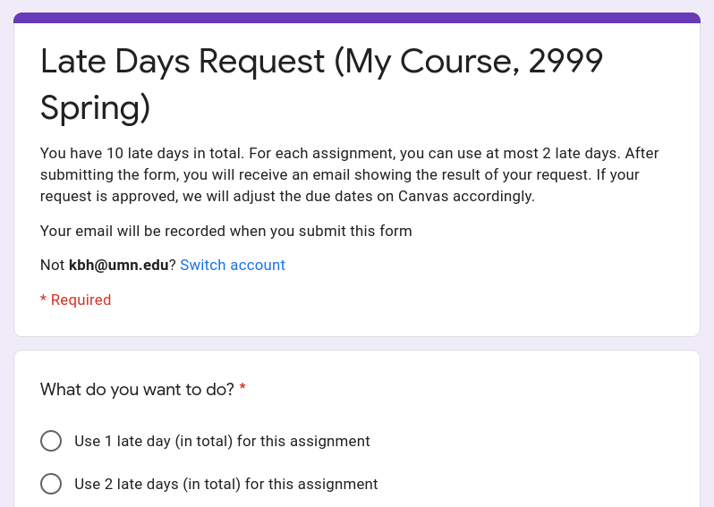

= 🏃 Late Days

Management of late day requests using Google Forms and Google Sheets

== ⚙️ Setting Up

. Create the configuration file `config/config.ts` from the sample `config/sample.ts`.
. Run the following commands:
+
[source,bash]
----
# install dependencies
npm ci

# build the JavaScript code
npm run build

# log into your Google account (if not globally logged in yet)
npm run clasp login

# create a new Google Apps Script project
npm run clasp create -- --type standalone --title "Late Days Script"

# deploy the code to the newly created Google Apps Script project
npm run deploy
----
. Run `npm run clasp open` to open the on-line script editor in the browser, and then execute the top-level function `init` within the opened script editor to initialize the form and the spreadsheet. The URLs will be printed in the execution log. (It is safe to run this function multiple times as it would not perform any action if the form and the spreadsheet have already been initialized.)

== ⬆️ Code Re-deployment

. Run the following commands after updating the code:
+
[source,bash]
----
npm run build
npm run deploy
----

=== ♻️ Form Regenaration

If the configuration is changed, you should also regenerate the form _after_ updating the code:

. Run `npm run clasp open` to open the on-line script editor in the browser, and then execute the top-level function `regenerateForm` within the opened script editor to regenerate the form.

== 🧘 Advanced Setup

It is possible to avoid `npm run clasp open` and execute top-level functions directly from the command line, but a much more advanced setup is needed. Carefully follow https://github.com/google/clasp/blob/master/docs/run.md[clasp`' documentation on `clasp run`] to enable this feature. (Caveat: it seems `executionApi.access` in `application.json` can remain to be `MYSELF` unless you want others to run the script; in other words, you do not have to modify `application.json` at all.)

== ©️ Copyright

Copyright 2020–2021 Kerno Development Team
